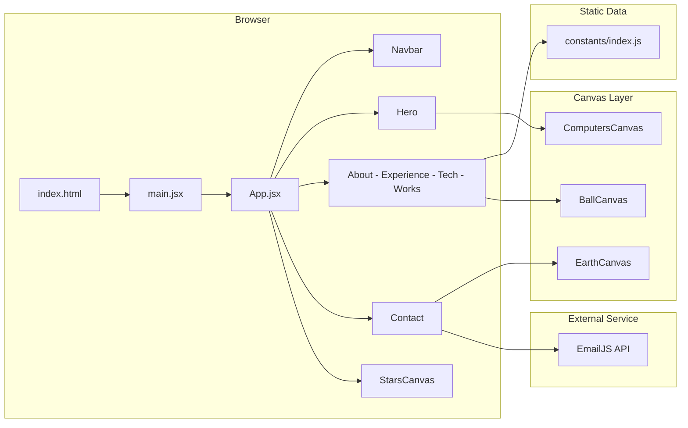
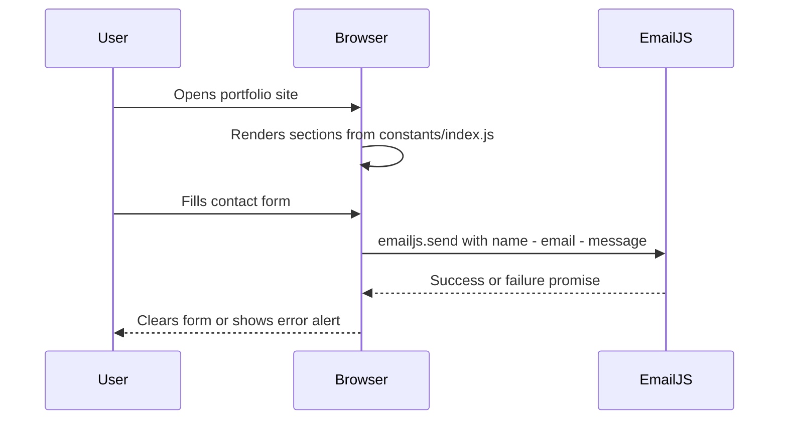
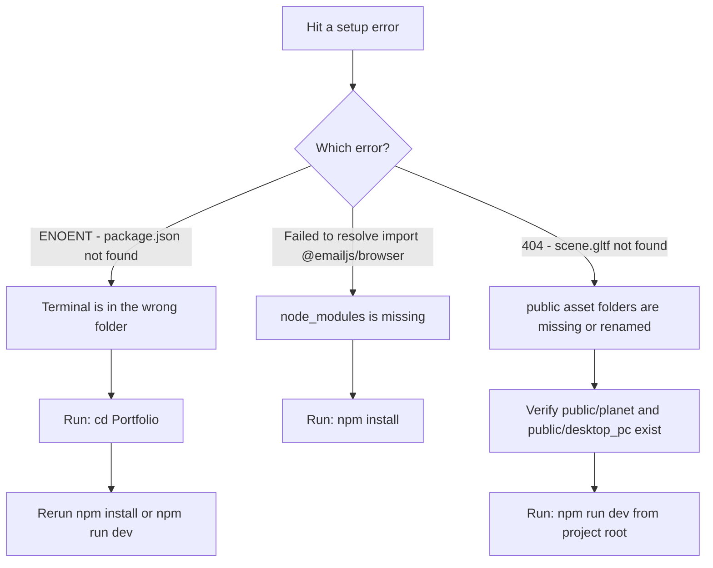

<div align="center">

# ⚙️Portfolio

> *A responsive 3D personal portfolio built with React and Vite — to showcase projects, experience, skills, and a working contact form in one interactive single-page site.*


[](#)


**[Get Started](#-installation) · [Features](#-features) · [Contribution](#-contributing)**

<a href="https://sandhya144.github.io/Portfolio/" target="_blank">
    
  </a>

</div>

---

## 🧾 About

A plain list of GitHub links doesn't tell anyone who you are or what you're capable of. 

Here, I've presented all my Technical skills, projects, education, experience, testimonials, and a working contact form.

Also solves the presentation problem for technical work. Instead of a plain list of links, the site combines motion, 3D visuals, timelines, and project cards so visitors can understand both capability and personality quickly.

---

## ✨ Features

| Feature | Description |
|---|---|
| 🧭 Responsive Navbar | Fixed navigation with desktop anchor links, mobile menu, and GitHub/LinkedIn shortcuts |
| 🦸 Animated Hero | Typed identity strings, tilt-powered profile image, and a CTA button |
| 🛠 Skills Showcase | Service cards with tilt and Framer Motion animations from `constants/index.js` |
| 📅 Experience Timeline | Chronological work history rendered with `react-vertical-timeline-component` |
| 🎓 Education Timeline | Separate education timeline using the same pattern as Experience |
| 🔮 3D Tech Badges | Floating rotating icon spheres via `BallCanvas` and Three.js |
| 💼 Project Gallery | Project cards with screenshots, tags, and direct GitHub repository links |
| 💬 Testimonials | Social proof cards rendered from the shared constants file |
| 📬 Contact Form | EmailJS-powered form with success/error feedback and an animated Earth canvas |
| 🌌 3D Backgrounds | `StarsCanvas`, `EarthCanvas`, and `ComputersCanvas` for visual depth |

---

## 🏗 Architecture



---

## ⚙️ Tech Stack

| Layer | Technology |
|---|---|
| Build tool | Vite |
| UI library | React 18 |
| Styling | Tailwind CSS |
| Animation | Framer Motion |
| 3D rendering | `@react-three/fiber`, `@react-three/drei`, Three.js |
| Visual interaction | `react-parallax-tilt`, `react-typed` |
| Timeline UI | `react-vertical-timeline-component` |
| Icons | `react-icons` |
| Email delivery | EmailJS Browser SDK |
| Routing shell | `react-router-dom` |
| Linting | ESLint |

---

## 🔄 How It Works



---

## 🚀 Installation

1. **Clone the repository:**

```bash
git clone https://github.com/sandhya144/Portfolio.git
```

2. **Move into the project directory:**

```bash
cd Portfolio
```

3. **Install dependencies:**

```bash
npm install
```

4. **Start the development server:**

```bash
npm run dev
```

5. **Build for production:**

```bash
npm run build
```

6. **Preview the production build locally:**

```bash
npm run preview
```

---

## 📁 Project Structure

```
Portfolio/
├── index.html                  
├── vite.config.js             
├── tailwind.config.js          # Tailwind CSS theme config
├── postcss.config.js           # PostCSS config for Tailwind
├── eslint.config.js            # ESLint rules for React and hooks
├── public/
│   ├── logo.svg
│   ├── desktop_pc/
│   │   ├── scene.gltf          # 3D computer model
│   │   ├── scene.bin
│   │   └── textures/
│   └── planet/
│       ├── scene.gltf          # 3D Earth model
│       ├── scene.bin
│       └── textures/
└── src/
    ├── main.jsx                # React entry — mounts App into #root
    ├── App.jsx                 # Top-level page composition
    ├── index.css               # Global CSS and Tailwind directives
    ├── style.js                # Shared Tailwind class bundles
    ├── assets/
    │   ├── index.js            # Central asset export registry
    │   ├── company/            # Company and education logos
    │   └── tech/               # Technology icons for skills section
    ├── components/
    │   ├── index.js            # Aggregated component exports
    │   ├── Navbar.jsx          # Fixed nav with anchor links and social icons
    │   ├── Hero.jsx            # Landing hero with typed text and profile image
    │   ├── About.jsx           # Service cards section
    │   ├── Experience.jsx      # Work experience timeline
    │   ├── Timeline.jsx        # Education timeline
    │   ├── Tech.jsx            # 3D tech badge balls
    │   ├── Works.jsx           # Project gallery cards
    │   ├── Feedbacks.jsx       # Testimonials section
    │   ├── Contact.jsx         # Contact form with EmailJS + EarthCanvas
    │   ├── Loader.jsx          # Loading overlay for 3D assets
    │   └── canvas/
    │       ├── index.js        # Canvas re-exports
    │       ├── Ball.jsx        # Rotating tech badge sphere
    │       ├── Computers.jsx   # 3D desktop computer scene
    │       ├── Earth.jsx       # Rotating Earth in Contact section
    │       └── Stars.jsx       # Starfield background canvas
    ├── constants/
    │   └── index.js            # All static content — nav, skills, projects, timelines
    ├── hoc/
    │   ├── index.js            # HOC exports
    │   └── SectionWrapper.jsx  # Adds section anchors and motion animation
    └── utils/
        └── motion.js           # Framer Motion variant generators
```

---

## 🛠 Troubleshooting



<details>
<summary>🔴 <strong>ENOENT: no such file or directory, open '...\\package.json'</strong></summary>

**Why it happens:** The terminal is open in a parent folder, so npm cannot find `package.json`.

**Fix:**
```bash
cd Portfolio
npm install
```

</details>

<details>
<summary>🔴 <strong>Failed to resolve import "@emailjs/browser"</strong></summary>

**Why it happens:** Dependencies have not been installed, or `node_modules` was deleted.

**Fix:**
```bash
npm install
```

</details>

<details>
<summary>🔴 <strong>404 Not Found — ./planet/scene.gltf or ./desktop_pc/scene.gltf</strong></summary>

**Why it happens:** The app is not being served from the Vite project root, or the `public/planet` and `public/desktop_pc` folders are missing or renamed.

**Fix:** Make sure both folders exist exactly as committed, then:
```bash
npm run dev
```

</details>

---

## 🗺 Roadmap

- [ ] Restore a real `href` for the `DOWNLOAD CV` button in `src/components/Hero.jsx`
- [ ] Move EmailJS service ID, template ID, and public key out of source code into `.env` variables
- [ ] Add inline validation and error messages to the contact form instead of relying on `alert()`
- [ ] Mount `ComputersCanvas` in the hero or remove the unused import if the 3D desktop model is no longer needed
- [ ] Add loading and fallback UI for failed Three.js asset loads in `EarthCanvas`, `BallCanvas`, and `ComputersCanvas`
- [ ] Replace hard-coded data in `src/constants/index.js` with a CMS or single editable config if easier maintenance is needed

---

## 🤝 Contributing

```bash
# 1. Create a feature branch
git checkout -b feature/your-change-name

# 2. Install dependencies and verify locally
npm install
npm run lint
npm run build
npm run dev

# 3. Stage and commit your work
git add .
git commit -m "feat: describe your change"

# 4. Push and open a pull request
git push -u origin feature/your-change-name
```

Open a pull request into `main`. Include what changed, what you tested, and any follow-up work needed.

---

## 📬 Contact & Acknowledgements

**Author:** Sandhya Pandey
**GitHub:** [github.com/sandhya144](https://github.com/sandhya144)
**LinkedIn:** [linkedin.com/in/sandhya-pandey-a662a3363](https://www.linkedin.com/in/sandhya-pandey-a662a3363/)
**Email:** 186sndy@gmail.com

Built with 💖 [React](https://react.dev/), [Vite](https://vitejs.dev/), [Three.js](https://threejs.org/), [Framer Motion](https://www.framer.com/motion/), and [EmailJS](https://www.emailjs.com/).

---

<div align="center">
  <a href="#portfolio">
    
  </a>
</div>
